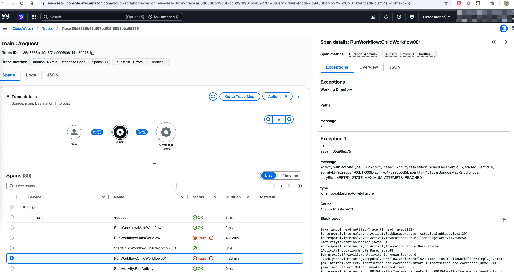
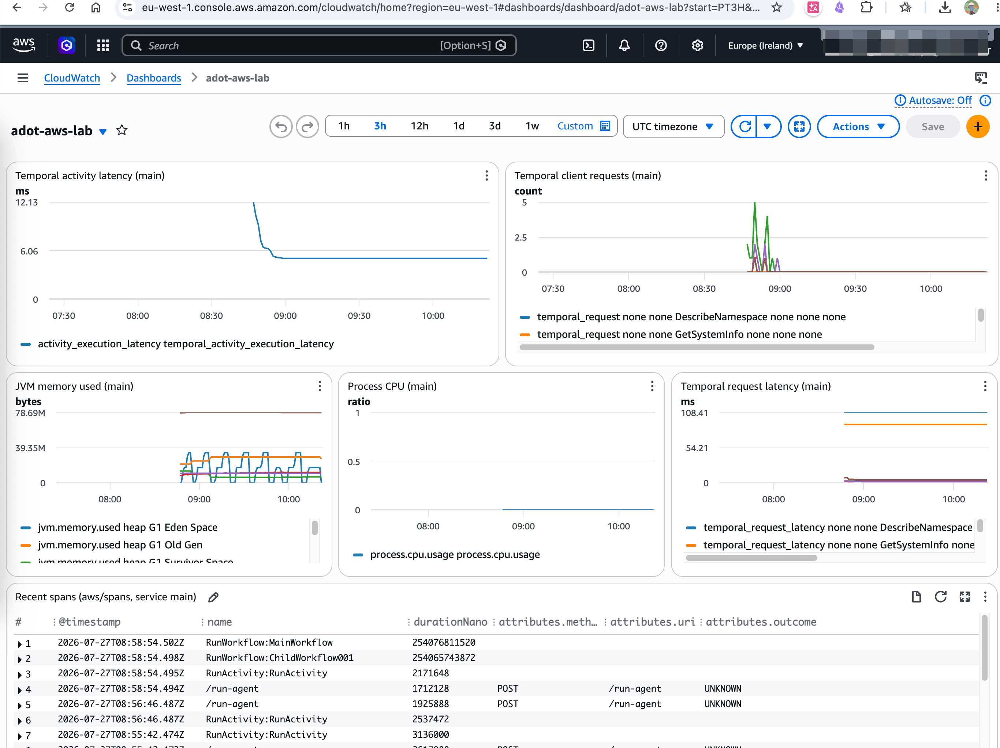

# Lab：Temporal + ADOT → CloudWatch / X-Ray

> 英文版：[lab-adot-aws.md](./lab-adot-aws.md)

## 假设

ADOT 可以把这个 Java Worker 上的 Temporal OpenTelemetry **traces** 与 **metrics**
转发到 AWS（X-Ray + CloudWatch）。这对应评估文档 Option B 对平台组件的技术前提，
以及 ADR-011 混合方案里 CloudWatch 这一层。

## 本 Lab 是什么 / 不是什么

| 是 | 不是 |
|----|------|
| Temporal Java → ADOT Collector → `awsxray` / `awsemf` | AgentCore Runtime 自动埋点 |
| 证明 Temporal **可以** 双写或迁到 CW | 证明 GenAI Observability 面板会渲染 Temporal span |
| 印证「ADOT + AWS 凭证 + log group」的接入成本 | 生产级转发设计（Firehose → NR、跨账号 OAM 等） |

[AWS 博客](https://aws.amazon.com/blogs/machine-learning/build-trustworthy-ai-agents-with-amazon-bedrock-agentcore-observability/)
面向 **Agent**，用的是 Python `aws-opentelemetry-distro`。Temporal 走的是通用 ADOT
Collector 导出器（`awsxray`、`awsemf`）。同一技术族，产品面不同。

## Lab 结论（已验证）

| 主题 | 结论 |
|------|------|
| Metrics 路径 | **通** — Micrometer OTLP → `awsemf` → `/icm-tracing/otel/metrics` → 命名空间 `ICMTracing/Temporal`（已有数据，`application=main`） |
| Dashboard | 可选：`./scripts/put-dashboard.sh` 用 JSON 创建 CloudWatch Dashboard `adot-aws-lab`（定义见 `dashboards/adot-aws-main.json`） |
| Traces 路径 | **通** — OTLP → `awsxray` → `PutTraceSegments`，`UnprocessedTraceSegments: []` |
| 去哪看 Trace | 若 X-Ray destination 是 **CloudWatchLogs**，看日志组 **`aws/spans`** / Transaction Search。**不要**把空的 `get-trace-summaries` 当成导出失败 |
| Collector 鉴权 | **不要**依赖把 `~/.aws` + `AWS_PROFILE` 挂进 ADOT 镜像。用 `aws configure export-credentials` 注入短期 Session（`./scripts/startup.sh`）。Compose 里空的 `AWS_ACCESS_KEY_ID=` 会盖掉 profile，导致导出失败 |
| 应用（JDK 25） | 使用 `mvn spring-boot:run -Dmaven.compiler.proc=full`，否则 Lombok 注解处理可能失败 |
| `service.name` | 设为 **`adot-aws`**（与 git 分支名一致），来源是 `spring.application.name` |

### 示例：CloudWatch / X-Ray Trace（拓扑 + Temporal spans）

跑完 `./scripts/01normal.sh` 后，Transaction Search 能看到 HTTP 入口（`/request`）、
父子 Workflow，以及失败 Activity 的重试。拓扑：**Client → adot-aws → remote HTTP**。



> 截图拍摄时 `service.name` 仍为 `main`。按本分支重启应用后，标题会显示为 **`adot-aws : /request`**。

### CloudWatch 自定义 Dashboard（JSON + CLI）

控制台里的 Metrics 默认是扁平列表，适合核对「有没有数」，不适合当运维面板。做法和 Grafana 类似：把 Dashboard 定义放进 Git，用 AWS CLI 一键创建/更新。

**本 Lab 对齐的已有数据：**

| 项 | 值 |
|----|-----|
| 命名空间 | `ICMTracing/Temporal` |
| 过滤条件 | `application=main`（更早一次跑 Lab 时 Micrometer 打的 tag） |
| Dashboard 名称 | `adot-aws-lab` |
| 定义文件 | [`dashboards/adot-aws-main.json`](../dashboards/adot-aws-main.json) |
| 部署脚本 | [`scripts/put-dashboard.sh`](../scripts/put-dashboard.sh) |

**1）先摸清指标名 / 维度**（`SEARCH(...)` 花括号里的维度集合必须和 EMF 一致）：

```shell
aws cloudwatch list-metrics \
  --namespace ICMTracing/Temporal \
  --region eu-west-1 \
  --query 'Metrics[].MetricName' \
  --output text | tr '\t' '\n' | sort -u

aws cloudwatch list-metrics \
  --namespace ICMTracing/Temporal \
  --metric-name temporal_activity_execution_failed \
  --region eu-west-1 \
  --max-items 1
```

**2）编写 Dashboard JSON** — widget 用 CloudWatch `SEARCH` 表达式，避免把 EMF 的每一种维度组合写死，例如：

```text
SEARCH('{ICMTracing/Temporal,application,lab} application="main" MetricName="process.cpu.usage"', 'Average', 60)
```

本 Lab 面板包括：Temporal activity 延迟 / client 请求量 / request 延迟、JVM 内存、进程 CPU，以及一张过滤 `service=main` 的 `aws/spans` 日志表。

**3）创建或更新 Dashboard：**

```shell
# 封装脚本（从 .env 读 AWS_REGION / AWS_PROFILE）
./scripts/put-dashboard.sh

# 等价的一条命令
aws cloudwatch put-dashboard \
  --dashboard-name adot-aws-lab \
  --dashboard-body file://dashboards/adot-aws-main.json \
  --region eu-west-1
```

成功时返回 `"DashboardValidationMessages": []`。

**4）打开：**

https://eu-west-1.console.aws.amazon.com/cloudwatch/home?region=eu-west-1#dashboards:name=adot-aws-lab

跑过 workflow（并等 EMF flush）后，面板大致如下：



**运维提示：** 改 JSON 再跑 `put-dashboard` 会按名称覆盖控制台里的同名板（幂等 upsert）。若在控制台里改过，可用 Dashboard → **Actions → View/edit source** 拷回 `dashboards/adot-aws-main.json`。

## 通过 / 失败检查清单

执行 `./scripts/startup.sh`，启动应用，再跑 `./scripts/01normal.sh`，然后确认：

- [ ] `docker compose logs otel-collector` 没有反复出现的 `AccessDenied` / 凭证错误
- [ ] Jaeger 中服务名为 **`adot-aws`**，能看到父→子 Workflow + Activity 重试 spans
- [ ] CloudWatch / Transaction Search 能看到服务 **`adot-aws`** 的 trace（日志组 `aws/spans`，或 X-Ray 控制台）
- [ ] CloudWatch 日志组 `/icm-tracing/otel/metrics` 有 EMF 事件
- [ ] CloudWatch Metrics 命名空间 `ICMTracing/Temporal` 有数据点（或打开 Dashboard `adot-aws-lab`）

### 对 ADR 的解读

| 结果 | 含义 |
|------|------|
| 全部通过 | Temporal 的 CW 路径 **技术可行**；Option B / 混合方案 Layer-1 对 Temporal 成立 |
| Trace 通、Metrics 缺失 | 查 Micrometer OTLP URL（`:4318/v1/metrics`）以及 `awsemf` 的 IAM / log group |
| 本地 Jaeger 通、AWS 空 | 多半是 Collector 凭证（重跑 `./scripts/startup.sh`）或 `otel-collector.yml` 区域不一致 |
| 技术通但运维仍偏 NR | 与 ADR-011 一致：NR 作 L2 运维视图；CW 作 L1 / Evaluations / 可选双写 |

## IAM 示意（Lab）

```json
{
  "Version": "2012-10-17",
  "Statement": [
    {
      "Effect": "Allow",
      "Action": [
        "xray:PutTraceSegments",
        "xray:PutTelemetryRecords",
        "xray:GetSamplingRules",
        "xray:GetSamplingTargets"
      ],
      "Resource": "*"
    },
    {
      "Effect": "Allow",
      "Action": [
        "logs:CreateLogGroup",
        "logs:CreateLogStream",
        "logs:PutLogEvents",
        "logs:DescribeLogStreams",
        "logs:DescribeLogGroups"
      ],
      "Resource": [
        "arn:aws:logs:*:*:log-group:/icm-tracing/otel/metrics*",
        "arn:aws:logs:*:*:log-group:aws/spans*"
      ]
    }
  ]
}
```

## 后续（本分支不做）

1. 双写：在 `awsxray` 旁保留 NR 导出器（ADR-011 对 Temporal 本身的混合）。
2. 对比 Transaction Search / Application Signals 与 NR APM 对 Temporal 工作流的体验。
3. 成本抽样：一次带 Activity 重试的 workflow，X-Ray / `aws/spans` 与 EMF 的摄入量。
4. 对比接入摩擦（AWS session 导出 + ADOT）vs（NR OTLP HTTPS + API key）——支撑评估里「外部 runtime 接入」标准（Temporal 偏 AWS 友好；托管 SaaS runtime 未必）。
